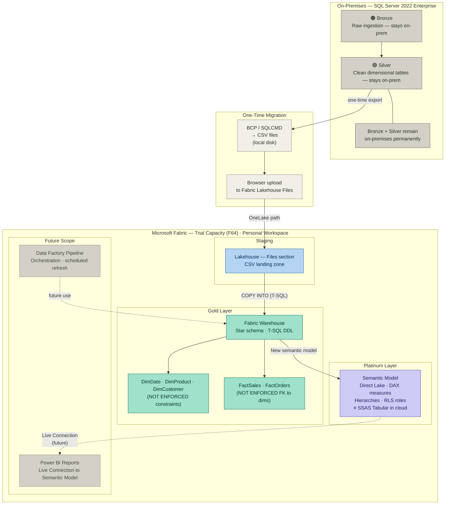

```mermaid
flowchart TD

    subgraph ONPREM["On-Premises — SQL Server 2022 Enterprise"]
        direction TB
        BRONZE["🟤 Bronze\nRaw ingestion — stays on-prem"]
        SILVER["🟢 Silver\nClean dimensional tables — stays on-prem"]
        NOTE["Bronze + Silver remain\non-premises permanently"]
        BRONZE --> SILVER
        SILVER --- NOTE
    end

    subgraph BRIDGE["One-Time Migration"]
        direction TB
        EXPORT["BCP / SQLCMD\n→ CSV files\n(local disk)"]
        UPLOAD["Browser upload\nto Fabric Lakehouse Files"]
        EXPORT --> UPLOAD
    end

    subgraph FABRIC["Microsoft Fabric — Trial Capacity (F64) · Personal Workspace"]
        direction TB

        subgraph STAGING["Staging"]
            LAKEHOUSE["Lakehouse — Files section\nCSV landing zone"]
        end

        subgraph GOLD["Gold Layer"]
            WAREHOUSE["Fabric Warehouse\nStar schema · T-SQL DDL"]
            DIMS["DimDate · DimProduct · DimCustomer\n(NOT ENFORCED constraints)"]
            FACTS["FactSales · FactOrders\n(NOT ENFORCED FK to dims)"]
            WAREHOUSE --> DIMS
            WAREHOUSE --> FACTS
        end

        subgraph PLATINUM["Platinum Layer"]
            SEMMODEL["Semantic Model\nDirect Lake · DAX measures\nHierarchies · RLS roles\n≡ SSAS Tabular in cloud"]
        end

        subgraph FUTURE["Future Scope"]
            ADF["Data Factory Pipeline\nOrchestration · scheduled refresh"]
            PBI["Power BI Reports\nLive Connection to Semantic Model"]
        end

        LAKEHOUSE -->|"COPY INTO (T-SQL)"| WAREHOUSE
        WAREHOUSE -->|"New semantic model"| SEMMODEL
        SEMMODEL -.->|"Live Connection\n(future)"| PBI
        ADF -.->|"future use"| WAREHOUSE
    end

    SILVER -->|"one-time export"| EXPORT
    UPLOAD -->|"OneLake path"| LAKEHOUSE

    classDef onprem   fill:#D3D1C7,stroke:#5F5E5A,color:#2C2C2A
    classDef bridge   fill:#F1EFE8,stroke:#888780,color:#2C2C2A
    classDef staging  fill:#B5D4F4,stroke:#185FA5,color:#042C53
    classDef gold     fill:#9FE1CB,stroke:#0F6E56,color:#04342C
    classDef platinum fill:#CECBF6,stroke:#534AB7,color:#26215C
    classDef future   fill:#D3D1C7,stroke:#888780,color:#444441

    class BRONZE,SILVER,NOTE onprem
    class EXPORT,UPLOAD bridge
    class LAKEHOUSE staging
    class WAREHOUSE,DIMS,FACTS gold
    class SEMMODEL platinum
    class ADF,PBI future
```
